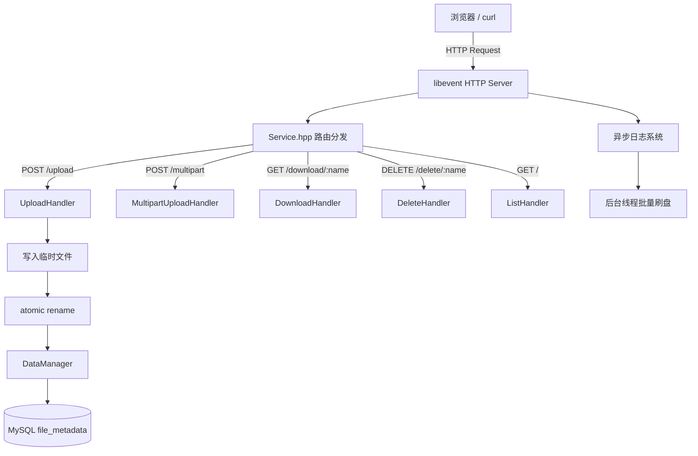

# AsynLogSystem-CloudStorage

> 基于 C++17 + libevent 的轻量云存储服务，集成自研异步日志系统。

[](https://isocpp.org/)
[](./LICENSE)
[]()

---

## 项目简介

本项目分为两个子系统：

- **异步日志系统**：支持异步写盘、多线程并发写日志、文件按大小/日期滚动、旧日志按数量/时间自动清理。
- **云存储服务**：类网盘功能，支持 Web 端文件上传（含分片断点续传）、下载、列表展示和删除，元数据持久化到 MySQL。

两者通过依赖注入结合，是一个兼顾工程深度与面试亮点的 C++ 综合项目。

---

## 功能特性

| 功能 | 说明 |
|------|------|
| 文件上传 | 支持普通上传和**分片断点续传** |
| 文件下载 | 支持完整文件下载，Content-Disposition 浏览器下载 |
| 文件删除 | Web 页面删除，同步清除磁盘文件与 MySQL 元数据 |
| 文件列表 | 展示文件名、大小、上传时间，支持搜索与排序 |
| 元数据持久化 | MySQL `file_metadata` 表，服务重启自动恢复 |
| 原子写入 | 临时文件 + `rename`，防止写入中途崩溃产生脏数据 |
| 安全校验 | 文件名合法性、URL 编码校验、路径穿越防护、上传大小限制 |
| 异步日志 | 业务线程写日志不阻塞，后台线程批量刷盘 |
| 日志轮转 | 按文件大小/日期滚动，按数量/时长清理旧日志 |

---

## 技术栈

- **C++17** — 核心语言，使用 `std::filesystem`、智能指针、lambda 等
- **libevent** — 事件驱动 HTTP 服务器
- **jsoncpp** — JSON 配置文件解析
- **MySQL C API** (`libmysqlclient`) — 元数据持久化
- **pthread** — 多线程支持
- **HTML / CSS / JavaScript** — 前端 Web 页面

---

## 项目结构

```text
Kama-AsynLogSystem-CloudStorage/
├── log_system/
│   ├── logs_code/              # 自研异步日志系统
│   │   ├── AsyncLogger.hpp     # 异步日志器
│   │   ├── AsyncWorker.hpp     # 异步工作者
│   │   ├── AsyncBuffer.hpp     # 双缓冲区
│   │   ├── LogFlush.hpp        # 日志落盘（滚动/控制台/文件）
│   │   ├── Manager.hpp         # 日志管理器单例
│   │   ├── Message.hpp         # 日志消息结构
│   │   ├── MyLog.hpp           # 对外宏接口
│   │   ├── ThreadPoll.hpp      # 线程池
│   │   ├── Util.hpp            # 工具类（JSON/时间/路径）
│   │   └── config.conf         # 日志系统配置
│   └── examples/               # 日志系统使用示例
├── src/
│   └── server/                 # 云存储服务端
│       ├── Test.cpp            # 服务入口 main()
│       ├── Service.hpp         # HTTP 路由与 libevent 上下文
│       ├── UploadHandler.hpp   # 普通上传处理
│       ├── MultipartUploadHandler.hpp  # 分片断点续传
│       ├── DownloadHandler.hpp # 下载处理
│       ├── DeleteHandler.hpp   # 删除处理
│       ├── ListHandler.hpp     # 文件列表与页面渲染入口
│       ├── PageRender.hpp      # HTML 页面渲染
│       ├── DataManager.hpp     # 元数据管理（内存 + MySQL）
│       ├── MysqlMetadataStore.hpp  # MySQL 元数据后端
│       ├── MetadataStore.hpp   # 元数据接口抽象
│       ├── StorageInfo.hpp     # 文件元数据结构
│       ├── Config.hpp          # 服务配置读取
│       ├── HttpUtil.hpp        # HTTP 工具函数
│       ├── Util.hpp            # 文件/JSON/URL 工具
│       ├── base64.cpp/h        # Base64 编解码
│       ├── Storage.conf        # 服务配置文件
│       ├── index.html          # Web 页面模板
│       ├── Makefile
│       └── run.sh              # 快速启动脚本
├── scripts/
│   ├── setup_mysql.sh          # 一键初始化 MySQL 数据库
│   ├── build.sh                # 编译脚本
│   └── start.sh                # 启动脚本（含密码环境变量）
├── PROJECT_STATUS.md           # 当前进度与后续计划
└── README.md
```

---

## 核心架构

### 请求处理流程



### 异步日志架构


---

## 快速开始

### 1. 安装依赖

```bash
# Ubuntu / Debian
sudo apt-get update
sudo apt-get install -y g++ make libevent-dev libjsoncpp-dev libmysqlclient-dev mysql-server
```

### 2. 初始化数据库

```bash
# 使用提供的脚本（会提示输入 MySQL root 密码）
bash scripts/setup_mysql.sh
```

或手动执行：

```bash
mysql -u root -p <<'SQL'
CREATE DATABASE IF NOT EXISTS cloud_storage DEFAULT CHARACTER SET utf8mb4;
CREATE USER IF NOT EXISTS 'cloud_user'@'localhost' IDENTIFIED BY 'your_password';
GRANT ALL PRIVILEGES ON cloud_storage.* TO 'cloud_user'@'localhost';
FLUSH PRIVILEGES;
SQL
```

> `MysqlMetadataStore` 会在首次启动时**自动创建** `file_metadata` 表，无需手动建表。

### 3. 修改配置

编辑 `src/server/Storage.conf`：

```json
{
    "server_port": 8081,
    "server_ip": "0.0.0.0",
    "storage_dir": "./storage/",
    "mysql_host": "127.0.0.1",
    "mysql_port": 3306,
    "mysql_user": "cloud_user",
    "mysql_password_env": "CLOUD_STORAGE_MYSQL_PASSWORD",
    "mysql_database": "cloud_storage",
    "max_upload_size": 1073741824
}
```

### 4. 编译

```bash
bash scripts/build.sh
# 或手动编译
cd src/server && make
```

### 5. 启动服务

```bash
bash scripts/start.sh
# 或手动启动
export CLOUD_STORAGE_MYSQL_PASSWORD='your_password'
cd src/server && ./test
# 指定配置文件：
# ./test Storage.conf ../../log_system/logs_code/config.conf
```

服务启动后打开浏览器访问：**http://127.0.0.1:8081/**

---

## API 接口

| 方法 | 路径 | 说明 |
|------|------|------|
| `GET` | `/` | 文件列表页面 |
| `POST` | `/upload` | 普通文件上传（Header: `FileName: <base64>` + 请求体为文件内容）|
| `POST` | `/multipart/init` | 分片上传初始化 |
| `POST` | `/multipart/upload` | 上传分片 |
| `POST` | `/multipart/complete` | 合并分片 |
| `GET` | `/download/<filename>` | 下载文件 |
| `DELETE` | `/delete/<filename>` | 删除文件 |

### curl 示例

```bash
# 查看文件列表
curl http://127.0.0.1:8081/

# 上传文件（文件名需 base64 编码）
FILENAME=$(echo -n "hello.txt" | base64)
curl -X POST \
  -H "FileName: $FILENAME" \
  --data-binary @hello.txt \
  http://127.0.0.1:8081/upload

# 下载文件
curl -O http://127.0.0.1:8081/download/hello.txt

# 删除文件
curl -X DELETE http://127.0.0.1:8081/delete/hello.txt
```

---

## 配置说明

### 服务端配置 `src/server/Storage.conf`

| 字段 | 说明 | 默认值 |
|------|------|--------|
| `server_port` | 监听端口 | `8081` |
| `server_ip` | 监听地址 | `0.0.0.0` |
| `storage_dir` | 文件存储目录 | `./storage/` |
| `mysql_host` | MySQL 主机 | `127.0.0.1` |
| `mysql_port` | MySQL 端口 | `3306` |
| `mysql_user` | MySQL 用户名 | `cloud_user` |
| `mysql_password_env` | 密码来源的环境变量名 | `CLOUD_STORAGE_MYSQL_PASSWORD` |
| `mysql_database` | 数据库名 | `cloud_storage` |
| `max_upload_size` | 最大上传文件大小（字节） | `1073741824`（1 GB）|

### 日志系统配置 `log_system/logs_code/config.conf`

| 字段 | 说明 |
|------|------|
| `thread_count` | 日志线程池大小 |
| `roll_file_max_size` | 单个日志文件最大大小（字节） |
| `roll_file_max_count` | 最多保留日志文件数 |
| `roll_file_max_age_days` | 日志文件最长保留天数 |

---

## 编译选项

```bash
cd src/server

# 正常编译
make

# Debug 编译（带 -g 符号，支持 gdb 调试）
make gdb_test

# 清理编译产物和运行时目录
make clean
```

---

## 日志文件

服务运行时日志写入 `src/server/logfile/` 下三个滚动日志：

| 日志名 | 路径 | 内容 |
|--------|------|------|
| `asynclogger` | `logfile/system/System_log.*` | 系统启动/路由事件 |
| `access_logger` | `logfile/access/Access_log.*` | HTTP 访问记录 |
| `storage_logger` | `logfile/storage/Storage_log.*` | 文件存储操作 |

---

## License

[MIT](./LICENSE)
