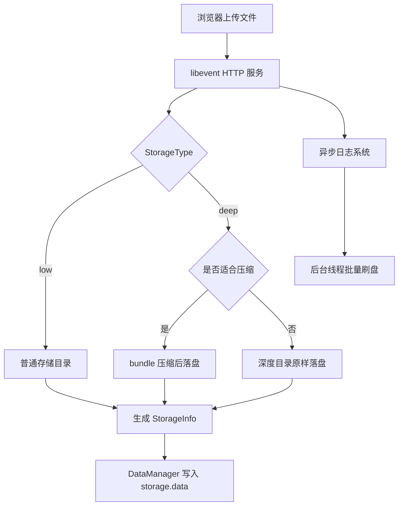
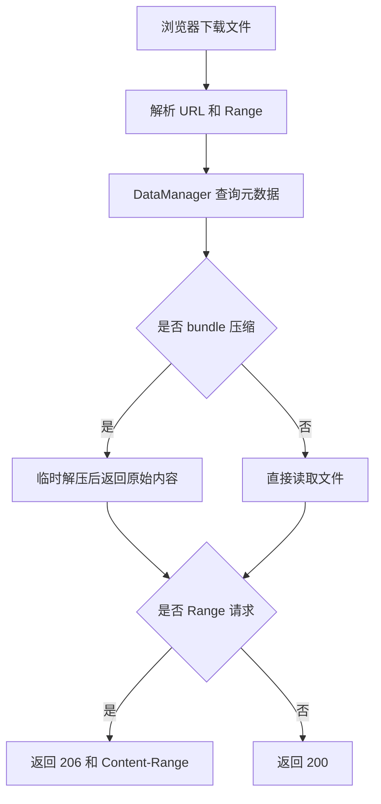

# Kama-AsynLogSystem-CloudStorage

一个基于 C++17 和 libevent 的轻量云存储服务，同时集成自研异步日志系统。项目当前定位不是完整商业网盘，而是一个适合学习、展示和面试讲解的工程项目：覆盖文件上传、普通存储、深度压缩存储、文件列表、下载、断点续传、删除、元数据持久化和日志轮转清理。

## 核心能力

- 文件上传：Web 页面上传文件，支持普通存储和深度存储。
- 深度存储：对适合压缩的文件使用 bundle 压缩存储，对 zip、图片、音视频、PDF 等已压缩格式避免二次压缩。
- 文件下载：支持完整下载和 HTTP Range 断点续传。
- 文件删除：支持 Web 页面删除文件，并同步删除元数据。
- 元数据管理：使用 `DataManager` 管理文件元数据，持久化到本地 `storage.data`。
- 安全校验：校验文件名、URL 编码、上传大小，避免路径穿越和基础 XSS 风险。
- 可靠写入：上传文件和元数据都采用临时文件加原子 `rename` 的方式写入。
- 异步日志：业务线程写日志后由后台线程异步刷盘，降低日志 IO 对业务流程的影响。
- 日志轮转：支持按大小、日期滚动日志，并按数量/时间清理旧日志。

## 技术栈

- C++17
- libevent
- jsoncpp
- pthread
- bundle 压缩库
- 自研异步日志系统
- HTML/CSS/JavaScript Web 页面

## 项目结构

```text
Kama-AsynLogSystem-CloudStorage/
├── log_system/                 # 自研异步日志系统
│   ├── logs_code/
│   │   ├── AsyncLogger.hpp
│   │   ├── AsyncWorker.hpp
│   │   ├── AsyncBuffer.hpp
│   │   ├── LogFlush.hpp
│   │   ├── Manager.hpp
│   │   ├── Message.hpp
│   │   ├── MyLog.hpp
│   │   ├── ThreadPoll.hpp
│   │   ├── Util.hpp
│   │   └── config.conf
│   └── examples/
├── src/
│   ├── server/                 # 云存储服务端
│   │   ├── Test.cpp            # 服务端入口
│   │   ├── Service.hpp         # HTTP 路由、上传、下载、删除、列表
│   │   ├── DataManager.hpp     # 文件元数据管理和持久化
│   │   ├── Config.hpp          # 服务端配置
│   │   ├── Util.hpp            # 文件、JSON、URL 工具
│   │   ├── Storage.conf        # 服务端配置文件
│   │   ├── index.html          # Web 页面模板
│   │   └── Makefile
│   └── client/                 # 早期客户端上传工具，当前仅保留作参考
├── PROJECT_STATUS.md           # 当前进度和下一步计划
└── README.md
```

## 核心流程





## 编译和运行

进入服务端目录：

```bash
cd /home/alex/projects/clound_storage/Kama-AsynLogSystem-CloudStorage/src/server
```

编译：

```bash
make
```

启动：

```bash
./test
```

服务端启动后会进入监听状态，终端不返回是正常现象。默认监听 `8081`，配置来自 `src/server/Storage.conf`。如果需要指定配置文件：

```bash
./test Storage.conf ../../log_system/logs_code/config.conf
```

## 常用接口示例

访问文件列表：

```bash
curl -i http://127.0.0.1:8081/
```

普通存储上传：

```bash
curl -i -X POST \
  -H FileName:Y29kZXhfY2hlY2sudHh0 \
  -H StorageType:low \
  --data-binary codex-ok \
  http://127.0.0.1:8081/upload
```

深度存储上传：

```bash
curl -i -X POST \
  -H FileName:Y29kZXhfZGVlcC50eHQ= \
  -H StorageType:deep \
  --data-binary deep-ok \
  http://127.0.0.1:8081/upload
```

下载：

```bash
curl -i http://127.0.0.1:8081/download/codex_check.txt
```

断点续传：

```bash
curl -i -H Range:bytes=0-3 http://127.0.0.1:8081/download/codex_range.txt
```

删除：

```bash
curl -i -X DELETE http://127.0.0.1:8081/delete/codex_check.txt
```

## 当前项目进度

当前已经完成：

- 上传、列表、下载、删除。
- 普通存储和深度压缩存储。
- 常见已压缩格式避免二次压缩。
- 元数据持久化和服务重启恢复。
- 文件名、URL、上传大小等基础安全校验。
- Range 断点续传。
- Web 页面搜索、排序、上传进度和删除反馈。
- 异步日志后台刷盘。
- 日志按大小/日期轮转和按数量/时间清理。

详细进度和下一步计划见 [PROJECT_STATUS.md](PROJECT_STATUS.md)。

## 面试讲解主线

可以按这条线介绍项目：

> 我实现了一个基于 C++17 和 libevent 的轻量云存储服务，支持文件上传、普通存储、深度压缩存储、下载、断点续传和删除。文件元数据由 `DataManager` 管理，并持久化到本地 JSON 文件中。为了保证可靠性，文件和元数据写入都采用临时文件加原子 `rename` 的方式。项目还集成了自研异步日志系统，通过异步缓冲和后台刷盘降低业务线程的日志开销，并支持日志轮转和清理。

重点可展开：

- HTTP 请求如何分发到上传、下载、删除、列表。
- 普通存储和深度存储的区别。
- 元数据如何组织、持久化和恢复。
- 为什么写文件和元数据要用临时文件加 `rename`。
- 如何防止路径穿越和基础 XSS。
- 断点续传如何解析 `Range`。
- 异步日志如何降低业务线程阻塞。
- 后续如何扩展：文件 hash、分页、MySQL 元数据、多用户鉴权。

## 原始学习资料

# C++项目推荐：基于异步日志系统的云存储 | 代码随想录

> **本项目目前只在[知识星球](https://programmercarl.com/other/kstar.html)答疑并维护**。

这次带大家做一个全新的C++项目：基于异步日志系统的云存储。

这个项目主要有两个部分：

日志部分：
1. 支持异步写日志，防止写日志阻塞外部业务逻辑
2. 支持备份重要日志，防止crush后无法debug
3. 支持多线程程序并发写日志
4. 支持输出日志到控制台、文件以及按照文件大小滚动文件中，文件大小可配置

存储部分：
1. 是一个类似于网盘的项目
2. 支持浅度存储和深度存储
3. web端上传下载

其实这个项目可以拆成两个项目，一个是异步日志系统，一个是云存储。

为什么要结合一些？

主要是亮点：

* 带大家感受一下，异步日志系统 如何嫁接在另一个系统上
* 这个项目更丰满，符合星球里 四星的标准！

为什么要做这个项目呢。 首先来聊一聊 日志系统的重要性。

日志系统在软件开发中作用主要在代码编写和调试以及项目启动后的系统运行状况记录。

能够详细记录程序的执行流程、变量的值以及函数的调用情况等，所需要的任何信息都可以通过日志来获取。

由于日志系统在项目的整个生命周期中都有着不可替代的作用，**因此可以说任何项目都可以并且应该集成日志系统以便debug，性能分析等操作**。

也就是说**设计好日志系统 可以嫁接到 所有C++项目里**。

就拿星球里目前的C++项目来举例，例如：

* 基于异步日志系统的 [HTTP服务框架（C++）](https://programmercarl.com/other/project_http.html)
* 基于异步日志系统的[手撕RPC框架（新项目）（C++）](https://programmercarl.com/other/project_C++RPC.html)
* 基于异步日志系统的[分布式存储项目（第二版）（C++）](https://programmercarl.com/other/project_fenbushi.html)
* 基于异步日志系统的[轻量级网络库muduo（第二版）（C++）](https://programmercarl.com/other/project_muduo.html)
* 基于异步日志系统的[高性能服务器项目（C++）](https://programmercarl.com/other/project_webserver.html)

等等等， 写好异步日志系统，可以嫁接到所有的项目里，为项目添加亮点毕竟所有的项目都需要打日志！

**如果感觉你自己的项目没有亮点可说，那么就可以在项目里添加个异步日志系统，增加亮点**！

## 基于异步日志系统的云存储项目精讲


该项目的专栏是[知识星球](https://programmercarl.com/other/kstar.html)录友专享的。

项目专栏依然是将 「简历写法」给大家列出来了，大家学完就可以参考这个来写简历：

给出一般写法，适用于 基础不太好的录友写：

<div align="center"></img></div>

给出高阶写法，适用于 想冲刺大厂的录友写：

<div align="center"></img></div>

做完该项目，面试中大概率会有哪些面试问题，以及如何回答，也列出好了：

<div align="center"></img></div>

专栏中的项目面试题都掌握的话，这个项目在面试中基本没问题。

很多录友在做项目的时候，把项目运行起来 就是第一大难点！

不少录友对日志系统还不了解，所以我们先从最基本的日志系统开始讲解，然后再讲异步日志：

<div align="center"></img></div>

日志系统主要有四大点：日志记录器、日志级别、日志格式化器、日志输出器 ：

<div align="center"></img></div>

接下来再讲 基于异步日志系统的云存储整体框架：

<div align="center"></img></div>

图文并茂：

<div align="center"></img></div>

我们这个项目是有页面的： （C++项目很少有页面，主要是本项目是云存储，我们从web端上传和下载文件）

<div align="center"></img></div>

最后也给出项目的拓展方向，大家如果学有余力，可以自行去拓展，不断深挖：

<div align="center"></img></div>

## 答疑

本项目在[知识星球](https://programmercarl.com/other/kstar.html)里为 文字专栏形式，大家不用担心，看不懂，星球里每个项目有专属答疑群，任何问题都可以在群里问，都会得到解答：


## 获取本项目专栏

**本文档仅为星球内部专享，大家可以加入[知识星球](https://programmercarl.com/other/kstar.html)里获取，在星球置顶一**


